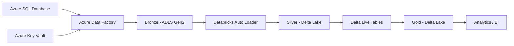

# Spotify Data Engineering Project on Azure

An end-to-end **Azure Data Engineering** project implementing metadata-driven ingestion, incremental loading, historical BackDate refresh, Medallion Architecture, Databricks transformations, Delta Lake, Delta Live Tables, data quality, and secure secret management with Azure Key Vault.

## Architecture



## Medallion Architecture

| Layer | Purpose | Technology |
|---|---|---|
| Bronze | Raw and incrementally ingested source data | ADF + ADLS Gen2 |
| Silver | Cleaned, deduplicated and transformed data | Databricks + PySpark + Delta Lake |
| Gold | Curated analytical datasets | Delta Live Tables + Delta Lake |

## Azure Data Factory

Azure Data Factory is used as the ingestion and orchestration layer. The solution uses a metadata-driven pipeline instead of maintaining a separate ingestion pipeline for each source table.

The main incremental pipeline is:

```text
LoopIncreamentalLoading
```

### Source Metadata

| Source Table | Incremental Column |
|---|---|
| `dbo.DimArtist` | `updated_at` |
| `dbo.DimUser` | `updated_at` |
| `dbo.DimTrack` | `updated_at` |
| `dbo.DimDate` | `date` |
| `dbo.FactStream` | `stream_timestamp` |

The metadata controls the schema, table, incremental column, and BackDate behavior used by the ingestion framework.

## Metadata-Driven Incremental Loading

For each configured table, the ADF pipeline:

1. Reads the table metadata.
2. Iterates through tables using `ForEach`.
3. Reads the previous `LastLoad` watermark from ADLS.
4. Retrieves the latest incremental-column value from Azure SQL.
5. Dynamically creates the source query.
6. Copies new records to the Bronze layer as Parquet.
7. Checks whether rows were loaded.
8. Updates `LastLoad` after a successful data load.
9. Deletes the newly generated file when no records are returned.

Conceptually:

```sql
SELECT *
FROM schema.table
WHERE incremental_column > LastLoad;
```

This avoids repeatedly processing the complete source dataset.

## LastLoad Watermark

Each table maintains its own `LastLoad` value under the Bronze storage area.

```text
Read LastLoad
     |
     v
Extract new records
     |
     v
Rows loaded?
  /       \
YES       NO
 |         |
 v         v
Update    Preserve state
LastLoad
```

## BackDate Historical Refresh

The project also supports **BackDate-based historical reprocessing**.

The ADF pipeline dynamically chooses between `LastLoad` and `BackDate`:

```text
Is BackDate empty?
       |
   +---+---+
   |       |
  YES      NO
   |       |
   v       v
LastLoad BackDate
   |       |
   +---+---+
       |
       v
Incremental Query
```

When `BackDate` is empty, normal incremental loading starts from the stored `LastLoad`.

When `BackDate` is provided, the pipeline uses that historical date as the extraction starting point.

This enables:

- Historical data reprocessing
- Recovery after incomplete loads
- Reloading corrected source records
- Controlled historical refresh
- Table-level refresh configuration without changing core pipeline logic

## No-Data Handling

After ingestion, the pipeline evaluates the number of rows read.

```text
rowsRead > 0?
    |
 +--+--+
 |     |
YES    NO
 |     |
 v     v
Update Delete generated
LastLoad empty/recent file
```

This prevents unnecessary files from remaining in the Bronze layer when no incremental records are available.

## Bronze Layer

ADF writes source data to ADLS Gen2 as Parquet files.

Example logical structure:

```text
bronze/
├── sqldata/
│   ├── DimArtist/
│   ├── DimUser/
│   ├── DimTrack/
│   ├── DimDate/
│   └── FactStream/
└── LastLoad/
    ├── DimArtist/
    ├── DimUser/
    ├── DimTrack/
    ├── DimDate/
    └── FactStream/
```

## Azure Key Vault & Security

Azure Key Vault is incorporated into the project for secure management of sensitive configuration and credentials.

The security design separates secrets from business and pipeline logic wherever possible.

```text
Azure Data Factory
        |
        v
Azure Key Vault
        |
        v
Secrets / Credentials
        |
        v
Secure Service Connections
```

Benefits include:

- Centralized secret management
- Reduced credential exposure
- Separation of secrets from pipeline logic
- Easier credential rotation
- Improved production security

The Azure Data Factory instance is also configured with a **system-assigned managed identity**, providing a foundation for identity-based access to supported Azure resources.

> **Security Note:** Never commit plaintext passwords, tokens, keys, or connection strings to GitHub. Review exported ADF configuration before publishing the repository.

## Silver Layer

The Silver layer uses:

- Azure Databricks
- PySpark
- Databricks Auto Loader
- Structured Streaming
- Delta Lake

Processing flow:

```text
Bronze Parquet
      |
      v
Databricks Auto Loader
      |
      v
Structured Streaming
      |
      +--> Cleaning
      +--> Deduplication
      +--> Column transformations
      +--> Business transformations
      |
      v
Silver Delta Tables
```

Auto Loader uses `cloudFiles` with Parquet input. The processing also uses checkpoint locations, Delta format, and `trigger(once=True)` for controlled incremental execution.

### Silver Transformations

The Silver layer includes:

- Removal of `_rescued_data`
- Deduplication
- Column cleaning
- Business-rule transformations
- Delta writes
- Streaming checkpoints

Example deduplication keys:

| Table | Key |
|---|---|
| `DimArtist` | `artist_id` |
| `DimDate` | `date_key` |
| `DimTrack` | `track_id` |
| `DimUser` | `user_id` |

For `DimTrack`, additional logic creates a duration category and cleans track names.

## Gold Layer

The Gold layer uses **Delta Live Tables (DLT)** to create curated analytical datasets from Silver Delta data.

```text
Silver Delta
     |
     v
Delta Live Tables
     |
     +--> CDC
     +--> Data Quality
     +--> SCD Type 1
     +--> SCD Type 2
     |
     v
Gold Delta
```

## Slowly Changing Dimensions

| Table | Strategy | Key | Sequence Column |
|---|---|---|---|
| `DimDate` | SCD Type 2 | `date_key` | `date` |
| `DimTrack` | SCD Type 2 | `track_id` | `updated_at` |
| `DimUser` | SCD Type 2 | `user_id` | `updated_at` |
| `FactStream` | SCD Type 1 | `stream_id` | `stream_timestamp` |

SCD Type 2 preserves historical dimension changes for `DimDate`, `DimTrack`, and `DimUser`.

SCD Type 1 is used for `FactStream`, where the current record state is maintained.

## Data Quality

The Gold pipeline demonstrates DLT data-quality expectations.

For example, `DimUser` validates:

```sql
user_id IS NOT NULL
```

Records that fail the configured expectation can be dropped before entering the curated table.

## Data Model

The project uses a Spotify-style dimensional model with the following main entities:

- `DimArtist`
- `DimUser`
- `DimTrack`
- `DimDate`
- `FactStream`

```text
                 DimDate
                    |
                    v
DimUser ------> FactStream <------ DimTrack
                                      |
                                      v
                                  DimArtist
```

## Repository Structure

```text
AzureETEProject/
├── AzureCode/
│   ├── dataset/
│   ├── factory/
│   ├── linkedService/
│   └── pipeline/
├── SourceFiles/
│   ├── spotify_initial_load.sql
│   ├── spotify_incremental_load.sql
│   ├── tablesdata.json
│   ├── Query_to_drop_PK.sql
│   └── empty.json
└── DatabricksCode/
    └── AzureProjectDB/
        ├── databricks.yml
        ├── pyproject.toml
        ├── resources/
        │   └── AzureProjectDB_etl.pipeline.yml
        └── src/
            ├── AzureProjectDB/
            └── AzureProjectDB_etl/
                └── transformations/
                    ├── silver/
                    │   └── silverLayer.ipynb
                    └── gold/
                        ├── goldLayer.ipynb
                        └── goldPipeline/
                            ├── DimDate.py
                            ├── DimTrack.py
                            ├── DimUser.py
                            └── FactStream.py
```

## Source Files

### `spotify_initial_load.sql`

Contains SQL used to prepare/populate the initial source dataset.

### `spotify_incremental_load.sql`

Supports source-data changes used to demonstrate incremental ingestion.

### `tablesdata.json`

Contains table-level metadata used by the ADF ingestion framework, including schema, table, incremental column, and BackDate configuration.

### `Query_to_drop_PK.sql`

Contains supporting SQL used during source/data setup.

### `empty.json`

Supporting JSON file used by the project.

## Technology Stack

| Technology | Purpose |
|---|---|
| Azure SQL Database | Source relational database |
| Azure Data Factory | Ingestion and orchestration |
| Azure Data Lake Storage Gen2 | Data lake storage |
| Azure Key Vault | Secret management |
| Azure Databricks | Data transformation |
| PySpark | Distributed data processing |
| Auto Loader | Incremental file ingestion |
| Structured Streaming | Incremental processing |
| Delta Lake | Reliable table storage |
| Delta Live Tables | Gold processing and CDC |
| Python | Transformation and pipeline code |
| SQL | Source preparation and extraction |
| Git / GitHub | Version control |
| Databricks Asset Bundles | Databricks project configuration |

## End-to-End Execution Flow

```text
1. Data is available in Azure SQL Database
                    |
                    v
2. ADF reads table metadata
                    |
                    v
3. ForEach processes configured tables
                    |
                    v
4. ADF reads LastLoad
                    |
                    v
5. Pipeline checks BackDate
              /             \
      BackDate set        BackDate empty
           |                   |
           v                   v
      Use BackDate         Use LastLoad
              \             /
                    |
                    v
6. Generate incremental SQL query
                    |
                    v
7. Copy data to Bronze as Parquet
                    |
                    v
8. Check rowsRead
              /             \
          > 0                = 0
           |                  |
           v                  v
    Update LastLoad     Delete generated file
           |
           v
9. Auto Loader processes Bronze
           |
           v
10. PySpark creates Silver Delta data
           |
           v
11. DLT processes Silver data
           |
           v
12. Apply data quality and SCD rules
           |
           v
13. Produce curated Gold data
           |
           v
14. Data is ready for Analytics / BI
```

## Key Features

- End-to-end Azure Data Engineering solution
- Medallion Architecture
- Metadata-driven ADF ingestion
- Reusable `ForEach` ingestion framework
- Dynamic SQL extraction
- Incremental data loading
- Per-table `LastLoad` watermark management
- BackDate historical refresh/reprocessing
- No-data file cleanup
- Azure Key Vault for secret management
- ADF system-assigned managed identity
- ADLS Gen2
- Parquet
- Databricks Auto Loader
- Structured Streaming
- PySpark transformations
- Delta Lake
- Deduplication
- Streaming checkpoints
- Delta Live Tables
- CDC processing
- SCD Type 1
- SCD Type 2
- Data-quality expectations
- Databricks Asset Bundle project structure
- Git/GitHub source control

## Security Best Practices

1. Store sensitive secrets in Azure Key Vault.
2. Never commit plaintext credentials to GitHub.
3. Use Managed Identity where appropriate.
4. Follow least-privilege access principles.
5. Keep environment-specific secrets outside source code.
6. Review exported ADF JSON before publishing.
7. Rotate credentials if they are accidentally exposed.

## Summary

```text
Azure SQL Database
        ↓
Metadata-Driven ADF Ingestion
        ↓
Incremental Loading
        ↓
LastLoad + BackDate Reprocessing
        ↓
ADLS Gen2 Bronze
        ↓
Databricks Auto Loader
        ↓
PySpark Transformations
        ↓
Silver Delta
        ↓
Delta Live Tables
        ↓
SCD + Data Quality
        ↓
Gold Delta
        ↓
Analytics / BI
```

This project demonstrates a complete Azure data engineering workflow combining **metadata-driven ingestion, incremental processing, controlled historical reprocessing, secure secret management, Delta Lake transformations, data quality, and curated analytical datasets**.
---

# Author

**Dipak**

GitHub: [CodeWithDipak](https://github.com/CodeWithDipak)

---

# License

No license file is currently included in the repository. If this project is intended for public reuse, add an appropriate open-source license before accepting external contributions.
